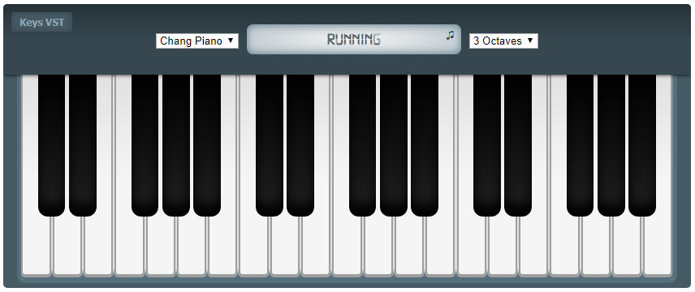
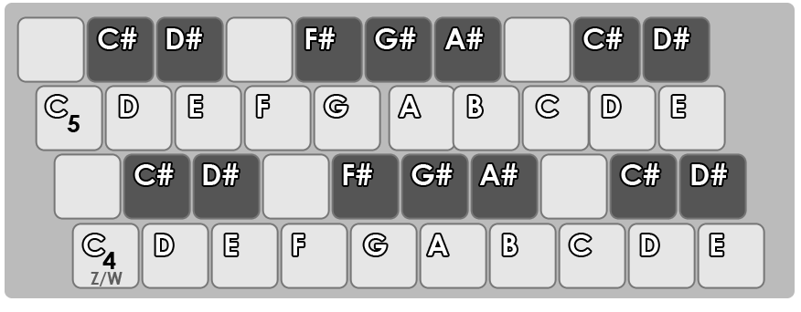

# KeysVST
A simple web-based, 7-octave, 88-key keyboard VST. This module is part of [Chakavang](https://github.com/chakavang) project.

- [Online Demo](http://chakavang.milad-ab.ir/KeysVST/tests/test.html)

## Keyboard Map

Hotkey | Description
------ | -----------
`ctrl` + `shift` + NUMBER (1-5) | Shift Octaves

## Browser Support
Browser | Version | Browser | Version
------- | ------- | ------- | -------
Chrome | 35 | Internet Explorer | NO
Edge | ALL | Opera | 22
Firefox | 25 | Safari | 6

## License
The KeysVST is open-source library licensed under the [MIT license](https://opensource.org/licenses/MIT). For the full copyright and license information, please view the LICENSE file that was distributed with this source code.